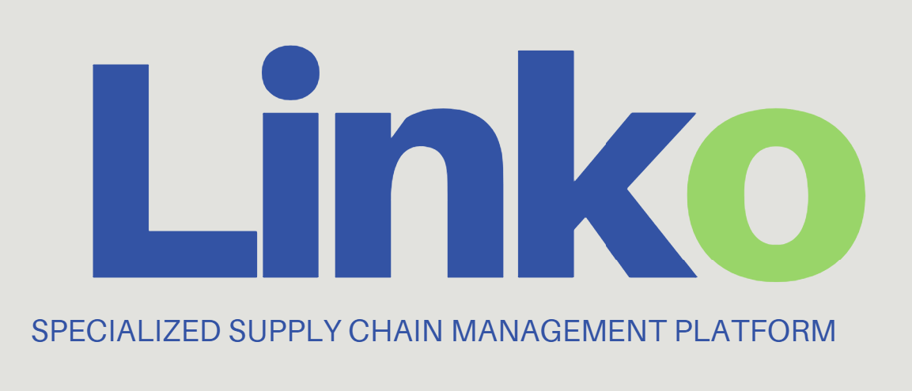

  

# LINKO

LINKO is a logistics, warehouse inventory tracking, and supplier-matching platform for MSMEs and wholesale providers.

The project is currently initiating its development phase, with the immediate focus on product design, planning, and defining the core user experience. This stage will shape the platform's workflows, data needs, and feature priorities before deeper implementation begins.

## Current Focus

- Define the product direction and development roadmap.
- Design the first web experience.
- Identify core workflows for inventory, suppliers, orders, and logistics.
- Prepare the project for step-by-step implementation.

See [ROADMAP.md](./ROADMAP.md) for the current strategic plan.
