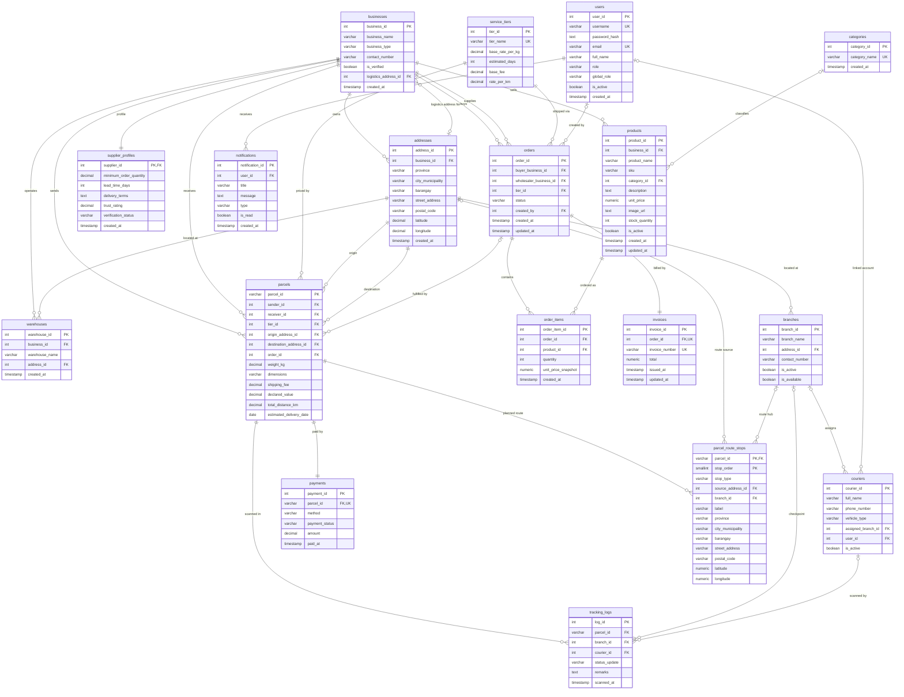

# LINKO — Entity Relationship Diagram (Market & Logistics)

Scoped to LINKO's two product domains — the buyer–wholesaler **marketplace** (businesses, catalog,
orders, invoices) and the CIS 2104 **logistics** core (parcels, payments, tracking, routing).
`users` and `businesses` are retained as the actor tables; the auth/identity plumbing
(`auth_sessions`, `user_businesses`, `business_memberships`) is intentionally omitted as
out-of-domain infrastructure.

