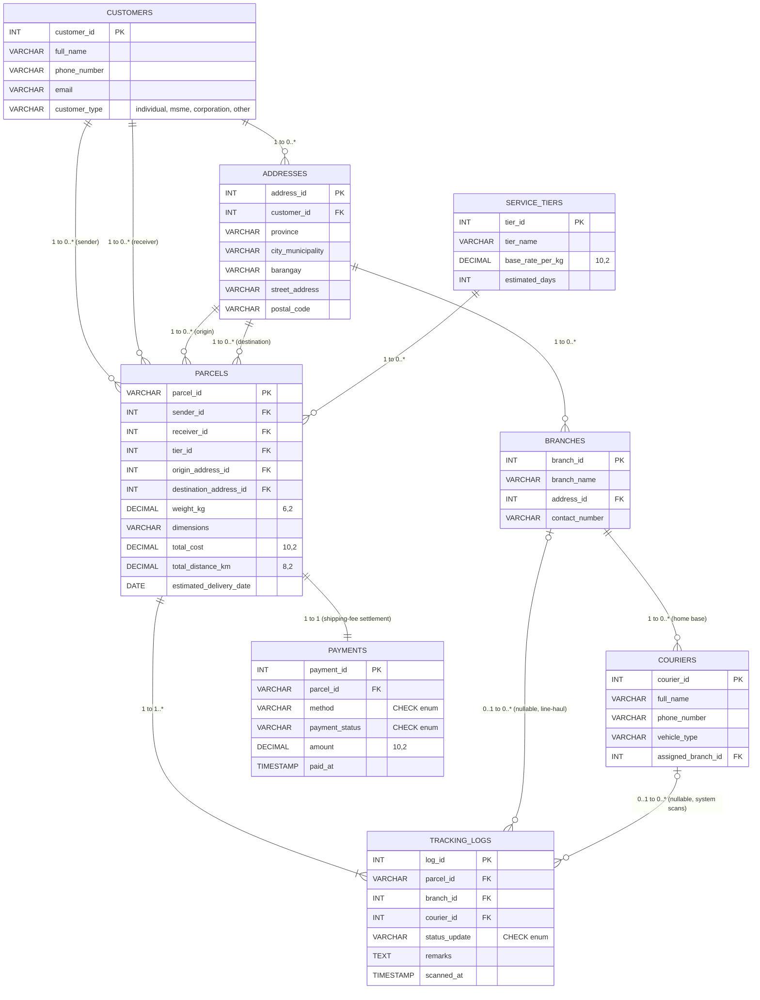

# LINKO — Logistics Subsystem Entity Relationship Diagram

---

## Tables

### SERVICE_TIERS

Delivery speed/pricing tiers (Standard, Express, Next-Day).

| Column           | Type          | Constraints      | Notes                                  |
| ---------------- | ------------- | ---------------- | -------------------------------------- |
| tier_id          | SERIAL        | PK               |                                        |
| tier_name        | VARCHAR(50)   | NOT NULL, UNIQUE | e.g. 'Standard', 'Express', 'Next-Day' |
| base_rate_per_kg | DECIMAL(10,2) | NOT NULL         | price per kg                           |
| estimated_days   | INT           | NOT NULL         | SLA window                             |

---

### ADDRESSES

Structured, granular address parts (Philippine hierarchy). Referenced by customers (1:N — a customer may have many addresses), branches, and parcels (origin + destination). Ownerless branch addresses leave `customer_id` null.

| Column            | Type         | Constraints              | Notes                                    |
| ----------------- | ------------ | ------------------------ | ---------------------------------------- |
| address_id        | SERIAL       | PK                       |                                          |
| customer_id       | INT          | FK → CUSTOMERS, NULLABLE | owner; null for branch addresses         |
| province          | VARCHAR(50)  | NOT NULL                 | e.g. 'Cebu'                              |
| city_municipality | VARCHAR(50)  | NOT NULL                 | e.g. 'Cebu City', 'Mandaue'              |
| barangay          | VARCHAR(50)  |                          | local district unit                      |
| street_address    | VARCHAR(150) |                          | house/lot/block no., street, subdivision |
| postal_code       | VARCHAR(10)  |                          |                                          |

---

### CUSTOMERS

Shared directory for senders and receivers. `customer_type` classifies **what kind of account it is** (individual, MSME, corporation, other) — not what it's doing in a transaction. Buy-vs-sell role is not stored here; it is read from which FK slot the customer occupies on a parcel (`sender_id` = selling, `receiver_id` = buying), so one actor can freely switch sides. Addresses live in `ADDRESSES` (1:N).

| Column        | Type         | Constraints                                                    | Notes                                                          |
| ------------- | ------------ | -------------------------------------------------------------- | -------------------------------------------------------------- |
| customer_id   | SERIAL       | PK                                                             |                                                                |
| full_name     | VARCHAR(100) | NOT NULL                                                       |                                                                |
| phone_number  | VARCHAR(20)  | NOT NULL                                                       | E.164 format                                                   |
| email         | VARCHAR(100) | UNIQUE                                                         |                                                                |
| customer_type | VARCHAR(20)  | NOT NULL, CHECK IN ('individual','msme','corporation','other') | account classification, not transaction role; role is per-parcel via FK |

---

### BRANCHES

Physical hubs/warehouses where parcels are processed. Location lives in `ADDRESSES`.

| Column         | Type         | Constraints              | Notes           |
| -------------- | ------------ | ------------------------ | --------------- |
| branch_id      | SERIAL       | PK                       |                 |
| branch_name    | VARCHAR(100) | NOT NULL, UNIQUE         | e.g. 'Cebu Hub' |
| address_id     | INT          | FK → ADDRESSES, NOT NULL | branch location |
| contact_number | VARCHAR(20)  |                          |                 |

---

### COURIERS

Riders/drivers who physically scan and move parcels, including on line-haul legs between branches.

| Column             | Type         | Constraints             | Notes                             |
| ------------------ | ------------ | ----------------------- | --------------------------------- |
| courier_id         | SERIAL       | PK                      |                                   |
| full_name          | VARCHAR(100) | NOT NULL                |                                   |
| phone_number       | VARCHAR(20)  | NOT NULL                |                                   |
| vehicle_type       | VARCHAR(30)  |                         | e.g. 'motorcycle', 'van', 'truck' |
| assigned_branch_id | INT          | FK → BRANCHES, NULLABLE | home base                         |

---

### PARCELS

Master record per package: weight, dimensions, cost, journey distance. Status and all timing live in `TRACKING_LOGS` (append-only event history).

| Column                  | Type          | Constraints                  | Notes                                                                         |
| ----------------------- | ------------- | ---------------------------- | ----------------------------------------------------------------------------- |
| parcel_id               | VARCHAR(20)   | PK                           | alphanumeric tracking number, e.g. 'LNK-10023456'                             |
| sender_id               | INT           | FK → CUSTOMERS, NOT NULL     |                                                                               |
| receiver_id             | INT           | FK → CUSTOMERS, NOT NULL     |                                                                               |
| tier_id                 | INT           | FK → SERVICE_TIERS, NOT NULL |                                                                               |
| origin_address_id       | INT           | FK → ADDRESSES, NOT NULL     | where shipped from                                                            |
| destination_address_id  | INT           | FK → ADDRESSES, NOT NULL     | delivery address (parcel label)                                               |
| weight_kg               | DECIMAL(6,2)  | NOT NULL, CHECK > 0          |                                                                               |
| dimensions              | VARCHAR(50)   |                              | e.g. '30x30x30 cm'                                                            |
| total_cost              | DECIMAL(10,2) | NOT NULL                     | = weight_kg × tier.base_rate_per_kg, set by trigger                           |
| total_distance_km       | DECIMAL(8,2)  |                              | origin → destination journey distance, fixed at ship time                     |
| estimated_delivery_date | DATE          |                              | promised ETA, frozen at ship time (creation + tier SLA); overridable on delay |

---

### PAYMENTS

Settlement of the **shipping fee** for one parcel (1:1). Scope is deliberately the delivery charge (`Parcels.total_cost`) only — NOT sale value, NOT commission, NOT marketplace checkout (those stay in the Orders/Payments domain). Exists to model COD vs prepaid and the "await payment before dispatch" hold.

| Column         | Type          | Constraints                                               | Notes                                                     |
| -------------- | ------------- | --------------------------------------------------------- | --------------------------------------------------------- |
| payment_id     | SERIAL        | PK                                                        |                                                           |
| parcel_id      | VARCHAR(20)   | FK → PARCELS, NOT NULL, UNIQUE                            | one payment per parcel (1:1)                              |
| method         | VARCHAR(20)   | NOT NULL, CHECK IN ('COD','Prepaid','Online')             | COD = collect cash on delivery                            |
| payment_status | VARCHAR(20)   | NOT NULL, CHECK IN ('Pending','Paid','Failed','Refunded') | dispatch gate: wholesaler ships only when 'Paid' (or COD) |
| amount         | DECIMAL(10,2) | NOT NULL                                                  | = `Parcels.total_cost` (shipping fee)                     |
| paid_at        | TIMESTAMP     | NULLABLE                                                  | null until settled; set when status → 'Paid'              |

---

### TRACKING_LOGS

Append-only history of every scan/status change. `scanned_at` carries per-event timing — the 'Order Created' row = creation, 'In Transit' row = dispatch, 'Delivered' row = delivery. Current status = latest row by `scanned_at`.

| Column        | Type        | Constraints               | Notes                                                                                                |
| ------------- | ----------- | ------------------------- | ---------------------------------------------------------------------------------------------------- |
| log_id        | SERIAL      | PK                        |                                                                                                      |
| parcel_id     | VARCHAR(20) | FK → PARCELS, NOT NULL    |                                                                                                      |
| branch_id     | INT         | FK → BRANCHES, NULLABLE   | null = in-transit / line-haul, not at a hub                                                          |
| courier_id    | INT         | FK → COURIERS, NULLABLE   | null = automated/system scan                                                                         |
| status_update | VARCHAR(50) | NOT NULL, CHECK IN (...)  | enum: 'Order Created','Picked Up','In Transit','Out for Delivery','Delivered','Returned','Cancelled' |
| remarks       | TEXT        |                           | e.g. 'Sorted for local dispatch'                                                                     |
| scanned_at    | TIMESTAMP   | DEFAULT CURRENT_TIMESTAMP | per-event timestamp                                                                                  |

---

## Relationships Summary

| From          | To            | Cardinality   | Notes                                                             |
| ------------- | ------------- | ------------- | ----------------------------------------------------------------- |
| CUSTOMERS     | ADDRESSES     | 1 to 0..\*    | a customer may have many addresses                                |
| CUSTOMERS     | PARCELS       | 1 to 0..\*    | as sender (`sender_id`)                                           |
| CUSTOMERS     | PARCELS       | 1 to 0..\*    | as receiver (`receiver_id`) — two distinct FK roles to same table |
| ADDRESSES     | PARCELS       | 1 to 0..\*    | as origin (`origin_address_id`)                                   |
| ADDRESSES     | PARCELS       | 1 to 0..\*    | as destination (`destination_address_id`)                         |
| ADDRESSES     | BRANCHES      | 1 to 0..\*    | branch location                                                   |
| SERVICE_TIERS | PARCELS       | 1 to 0..\*    |                                                                   |
| PARCELS       | PAYMENTS      | 1 to 1        | one shipping-fee payment per parcel (`parcel_id` UNIQUE)          |
| PARCELS       | TRACKING_LOGS | 1 to 1..\*    | every parcel gets at least one log row on creation                |
| BRANCHES      | TRACKING_LOGS | 0..1 to 0..\* | nullable — line-haul scans have no branch                         |
| BRANCHES      | COURIERS      | 1 to 0..\*    | courier's home base                                               |
| COURIERS      | TRACKING_LOGS | 0..1 to 0..\* | nullable — system/automated scans have no courier                 |

---

## Design Notes / Deviations from Archived Spec

- **Status lives only in `TRACKING_LOGS`.** `Parcels` no longer carries `current_status`. Status is event data — it belongs in the append-only event log. Current status = the latest `Tracking_Logs` row by `scanned_at`. Trade-off: "where is my parcel now" needs a latest-row lookup instead of a single column read; acceptable at course scale, and normalization is the correct textbook stance.
- **Actual lifecycle timing lives in `Tracking_Logs`, not `Parcels`.** Creation, dispatch, and delivery times = the `scanned_at` of their respective status rows ('Order Created', 'In Transit', 'Delivered'). No `created_at`/`dispatched_at`/`delivered_at` columns on `Parcels` — those are event data.
- **`estimated_delivery_date` stored on `Parcels`, frozen at ship time.** Computed once at creation (creation time + tier SLA) and saved, exactly like `total_cost`. Deriving it live would let a future `Service_Tiers.estimated_days` change silently rewrite the promised ETA of old parcels — the same drift that justifies storing `total_cost`. Stored value also allows manual override when a parcel is delayed (typhoon, branch reschedule). Actual delivery time still comes from the 'Delivered' log row; this column is the _promise_, not the fact.
- **`ADDRESSES` table for granular, unified addresses.** Flat `address_line`/`city` replaced by structured parts (province, city_municipality, barangay, street_address, postal_code) following Philippine address hierarchy. Consumed by customers (1:N), branches (FK), and parcels (origin + destination FK). No many-to-many anywhere — every link is a clean 1:N per academic standard.
- **Parcels carry origin + destination address.** Both `NOT NULL` — a parcel physically comes from somewhere and goes somewhere; neither can be null. Mirrors real parcel labels (receiver name + destination address).
- **`total_distance_km` on `Parcels`.** Origin → destination journey distance is one fixed value per parcel, set at ship time — a parcel property (like weight, like cost), not an event. Belongs on the master record, not the event log.
- **Status kept as a `CHECK` attribute, not a lookup table.** `Tracking_Logs.status_update` is `VARCHAR` with a `CHECK IN (...)` enum. Validates values without an extra table or join, and matches how canonical LINKO models enums (`role`, `business_type`).
- **`COURIERS` added** to answer "who scanned it." A scan has an actor. `courier_id` is nullable on `TRACKING_LOGS` for automated/system events; a courier has a home `BRANCHES` base.
- **`customer_type` is account classification, not transaction role.** `CUSTOMERS.customer_type` records _what kind of account it is_ — `individual` (a person), `msme` (micro/small/medium enterprise; sari-sari stores fold in here, no separate value to avoid overlap since a sari-sari store _is_ an MSME), `corporation` (large formal business), or `other` (escape hatch, no schema change to add a stray case). Buyer/wholesaler is a _role played per transaction_, not a fixed property: the same actor sells one parcel and buys the next. That role is read from the FK slot on `PARCELS` (`sender_id` = selling side, `receiver_id` = buying side), so an account can switch sides freely with zero writes to its type. "All accounts that only ever buy" is a query (appears as `receiver_id`, never `sender_id`), not a stored column — storing a role would be a fact copied from the parcels that can drift the moment the actor switches. Mirrors the accounting _party/role_ model.
- `Parcels.parcel_id` kept as `VARCHAR(20)` natural key (human tracking number) rather than surrogate `SERIAL`, per the goal's tracking-number requirement.
- `total_cost` is a derived value (weight × tier rate) kept as a stored column so historical pricing survives future `Service_Tiers` rate changes. Populate via `BEFORE INSERT` trigger.
- **`PAYMENTS` scoped to the shipping fee only.** This table settles `Parcels.total_cost` (the delivery charge) — nothing more. `method` (COD/Prepaid/Online) tells the courier whether to collect cash on delivery; `payment_status` is the dispatch gate — the wholesaler creates the 'Picked Up' tracking log only once status is `'Paid'` (or the parcel is COD, collected at the door). "Await payment before dispatch" is therefore modeled as: payment `Pending` → no dispatch log row exists yet. **Sale value, order totals, and commission remain out of scope** — a commission is LINKO's cut of a _sale_ (order value) charged at marketplace checkout, a separate Orders/Payments domain. This ERD models paying for _shipping_, not paying for _goods_: the only money here is the shipping fee and its settlement.

---

## Table Count

8 tables: **Service_Tiers, Addresses, Customers, Branches, Couriers, Parcels, Payments, Tracking_Logs**. Status is an attribute (`CHECK` enum), not a table. `Payments` covers shipping-fee settlement only (COD / prepaid / dispatch gate); sale value, order totals, and commission remain out of scope in the Orders/Payments domain.
