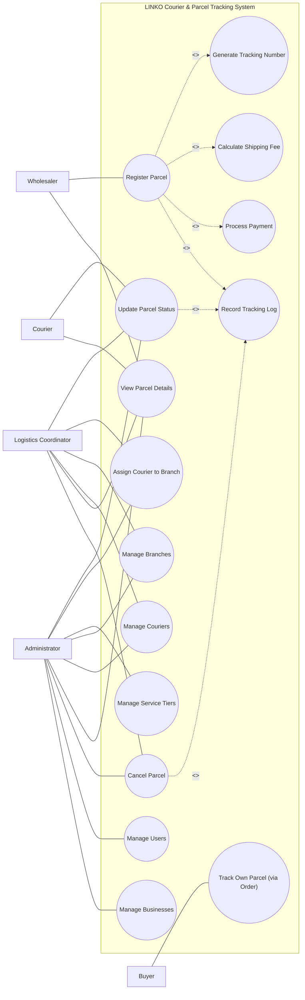

# LINKO Courier & Parcel Tracking System — Use Case Diagram

Aligned with `LINKO_USE-CASE.puml` (staging model) and the LINKO system's actual RBAC roles.

---

## Actor summary

| Actor | Use Cases |
|---|---|
| Buyer | Track Own Parcel (via Order) |
| Wholesaler | Register Parcel, View Parcel Details |
| Courier | Update Parcel Status, View Parcel Details |
| Logistics Coordinator | Update Parcel Status, Assign Courier to Branch, Manage Branches, Manage Couriers, View Parcel Details, Cancel Parcel |
| Administrator | Update Parcel Status, Assign Courier to Branch, Manage Service Tiers, Manage Branches, Manage Couriers, View Parcel Details, Cancel Parcel, Manage Users, Manage Businesses |

## Include relationships

| Base use case | Includes | Justification |
|---|---|---|
| Register Parcel | Generate Tracking Number | `parcel_id` is a natural key (tracking number) generated at creation |
| Register Parcel | Calculate Shipping Fee | `shipping_fee` set by trigger at insert |
| Register Parcel | Process Payment | `PAYMENTS.parcel_id` is `NOT NULL, UNIQUE` — every parcel gets a payment row |
| Register Parcel | Record Tracking Log | every parcel gets at least one log row ('Order Created') on creation |
| Update Parcel Status | Record Tracking Log | courier/coordinator status updates are written as tracking log rows |
| Cancel Parcel | Record Tracking Log | `Cancelled` is logged the same way, as a coordinator/admin override, not a courier state |

## Actor notes (mapping to the running system)

- **Register Parcel is wholesaler-gated.** `POST /api/parcels` and `POST /api/orders/:id/ship` are `R:wholesaler` — the shipping wholesaler is the parcel *Sender* in ERD terms. Coordinators and Administrators do not register parcels via the API; the `/logistics` "Create parcel" button operates within a wholesaler membership context.
- **Track Own Parcel is read-only and buyer-scoped.** `GET /api/parcels/:id` (buyer scope, API_CONTRACTS §3.6a) returns a buyer's own delivery only — no parcel list, no cross-order access.
- **Manage Service Tiers is edit-only (Sprint 12).** Update of existing tiers only; no add/delete.
- **Couriers are minted by the Administrator via Manage Users.** `POST /api/admin/users kind=courier` creates the login and the linked `couriers` row in one transaction. Coordinators only edit (PATCH) and deactivate couriers, never create them. Couriers auto-attach to the canonical LINKO Logistics org.
- **Cancel Parcel is a coordinator/admin override.** The ERD notes `Cancelled` is a *"temporary coordinator/admin override only, not a courier-submitted delivery state."* Keeping it separate from Update Parcel Status preserves the courier's normal delivery-state flow (Picked Up → In Transit → Out for Delivery → Delivered / Returned).

## Not modeled (by design)

No use case exists for commissions or wholesaler remittances. These were an earlier self-added extra, **removed entirely in migration `018`** — no `commissions`/`commission_brackets` tables, no `wholesaler_remittances` view, no trigger (see `docs/LINKO_ERD.md` and `docs/course-deliverable.md`). They are not modeled and must not be reintroduced; the goods payment goes to the wholesaler undivided (`payments.amount` = `declared_value` + `shipping_fee`).

# LINKO Courier & Parcel Tracking System

### User class summary

| User Class | Frequency | Technical Expertise | Privilege Level | Relative Importance |
|---|---|---|---|---|
| Buyer | High | Low | Standard (own orders/parcels, read-only tracking) | Most important |
| Wholesaler | High | Low–Moderate | Standard (own inventory, orders, parcel registration) | Most important |
| Courier | High (bursts) | Low–Moderate | Restricted (assigned parcels, no Cancel) | Important, secondary |
| Logistics Coordinator | Moderate | Moderate | Elevated (branches, couriers, assignment, override) | Important, operational |
| Administrator | Low–Moderate | Moderate–High | Highest (full config + user/business management) | Important, low-volume |

---
