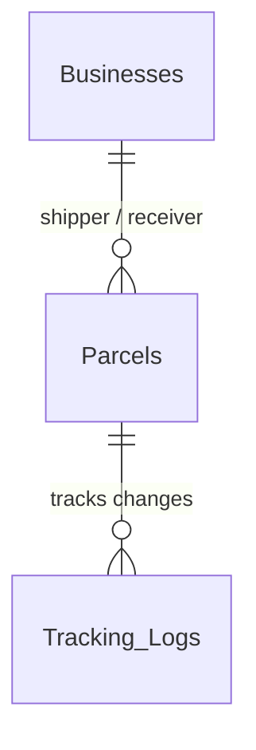

# LINKO Logistics Subsystem: Database Design & Implementation Specification (MVP)

_Last Updated: June 29, 2026_

## 1. System Overview & Scope Simplification (Model C Fallback)

To align strictly with the MVP scope and avoid overengineering, the logistics subsystem has been simplified to focus exclusively on **Model C (Seller Own Fleet)**.

All complex, multi-tiered shipping rate calculations, service level agreements (SLAs), and intermediate scanning hubs have been removed.

### De-Engineered Scope Principles:

1. **No Service Tiers**: Dropped the `Service_Tiers` configuration table. Shipping is assumed to be direct seller delivery.
2. **Simplified Pricing**: Shipping cost calculations are removed from database triggers. A simple `shipping_fee` column is stored directly on the parcel record.
3. **No Intermediate Hubs**: Dropped any concept of scanning hubs or warehouses in transit logs. Delivery is a direct point-to-point flow.
4. **Minimalistic Tables**: Reduced the database footprint from 5 tables to just **2 tables** (`Parcels` and `Tracking_Logs`).

---

## 2. Relational Database Schema Design (PostgreSQL)

This schema integrates with the core `Businesses` table.



### 2.1 Table: `Parcels`

The master record reflecting real-time parcel specifications and current transit states.

| Column Name      | Data Type     | Constraints                 | Description                                          |
| :--------------- | :------------ | :-------------------------- | :--------------------------------------------------- |
| `parcel_id`      | VARCHAR(20)   | PRIMARY KEY                 | Alphanumeric tracking number (e.g., 'LNK-10023456'). |
| `sender_id`      | INT           | FK (`Businesses`), NOT NULL | The shipping entity (Wholesaler).                    |
| `receiver_id`    | INT           | FK (`Businesses`), NOT NULL | The consignee entity (MSME Buyer).                   |
| `weight_kg`      | DECIMAL(6,2)  | NOT NULL                    | Physical mass weight of cargo.                       |
| `dimensions`     | VARCHAR(50)   |                             | Size details (e.g., '30x30x30 cm').                  |
| `shipping_fee`   | DECIMAL(10,2) | NOT NULL, DEFAULT 0.00      | Shipping charge set manually by the seller.          |
| `current_status` | VARCHAR(50)   | NOT NULL, CHECK constraint  | Current status state in the shipment pipeline.       |
| `created_at`     | TIMESTAMP     | DEFAULT CURRENT_TIMESTAMP   | Database ingestion timestamp.                        |

_Allowed `current_status` values_: `'Order Created'`, `'Pending Pickup'`, `'In Transit'`, `'Out for Delivery'`, `'Delivered'`, `'Cancelled'`, `'Disputed'`

### 2.2 Table: `Tracking_Logs`

An append-only log detailing transit checkpoints and state updates.

| Column Name     | Data Type   | Constraints               | Description                                                      |
| :-------------- | :---------- | :------------------------ | :--------------------------------------------------------------- |
| `log_id`        | SERIAL      | PRIMARY KEY               | Unique ID for the tracking log.                                  |
| `parcel_id`     | VARCHAR(20) | FK (`Parcels`), NOT NULL  | Target parcel relation context.                                  |
| `status_update` | VARCHAR(50) | NOT NULL                  | Status label at checkpoint.                                      |
| `remarks`       | TEXT        |                           | Explanatory notes (e.g., 'Dispatched via Wholesaler own truck'). |
| `scanned_at`    | TIMESTAMP   | DEFAULT CURRENT_TIMESTAMP | Time of tracking event entry.                                    |

---

## 3. SQL Data Definition Language (DDL) Script (PostgreSQL)

```sql
-- 1. Parcels Table
CREATE TABLE Parcels (
    parcel_id VARCHAR(20) PRIMARY KEY,
    sender_id INT NOT NULL REFERENCES Businesses(business_id) ON UPDATE CASCADE ON DELETE RESTRICT,
    receiver_id INT NOT NULL REFERENCES Businesses(business_id) ON UPDATE CASCADE ON DELETE RESTRICT,
    weight_kg DECIMAL(6,2) NOT NULL CHECK (weight_kg > 0.00),
    dimensions VARCHAR(50),
    shipping_fee DECIMAL(10,2) NOT NULL DEFAULT 0.00 CHECK (shipping_fee >= 0.00),
    current_status VARCHAR(50) NOT NULL DEFAULT 'Order Created'
        CHECK (current_status IN ('Order Created', 'Pending Pickup', 'In Transit', 'Out for Delivery', 'Delivered', 'Cancelled', 'Disputed')),
    created_at TIMESTAMP DEFAULT CURRENT_TIMESTAMP
);

-- 2. Tracking_Logs Table
CREATE TABLE Tracking_Logs (
    log_id SERIAL PRIMARY KEY,
    parcel_id VARCHAR(20) NOT NULL REFERENCES Parcels(parcel_id) ON UPDATE CASCADE ON DELETE CASCADE,
    status_update VARCHAR(50) NOT NULL,
    remarks TEXT,
    scanned_at TIMESTAMP DEFAULT CURRENT_TIMESTAMP
);
```

---

## 4. Automation & Performance Optimization

### 4.1 Append-Only History Logging Triggers

These triggers write tracking records automatically whenever a parcel is created or its status is updated.

```sql
-- Initial Log on Parcel Creation
CREATE OR REPLACE FUNCTION fn_log_parcel_initialization()
RETURNS TRIGGER AS $$
BEGIN
    INSERT INTO Tracking_Logs (parcel_id, status_update, remarks)
    VALUES (NEW.parcel_id, NEW.current_status, 'Fulfillment pipeline initialized (Seller Own Fleet).');
    RETURN NEW;
END;
$$ LANGUAGE plpgsql;

CREATE TRIGGER trg_log_parcel_initialization
AFTER INSERT ON Parcels
FOR EACH ROW
EXECUTE FUNCTION fn_log_parcel_initialization();

-- Log on Parcel Status Updates
CREATE OR REPLACE FUNCTION fn_log_parcel_mutation()
RETURNS TRIGGER AS $$
BEGIN
    IF OLD.current_status <> NEW.current_status THEN
        INSERT INTO Tracking_Logs (parcel_id, status_update, remarks)
        VALUES (NEW.parcel_id, NEW.current_status, CONCAT('Status updated from ', OLD.current_status, ' to ', NEW.current_status));
    END IF;
    RETURN NEW;
END;
$$ LANGUAGE plpgsql;

CREATE TRIGGER trg_log_parcel_mutation
AFTER UPDATE ON Parcels
FOR EACH ROW
EXECUTE FUNCTION fn_log_parcel_mutation();
```

### 4.2 Performance Indexes

```sql
CREATE INDEX idx_tracking_composite ON Tracking_Logs (parcel_id, scanned_at DESC);
CREATE INDEX idx_parcels_sender ON Parcels (sender_id);
CREATE INDEX idx_parcels_receiver ON Parcels (receiver_id);
```
